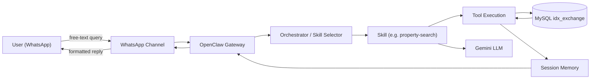
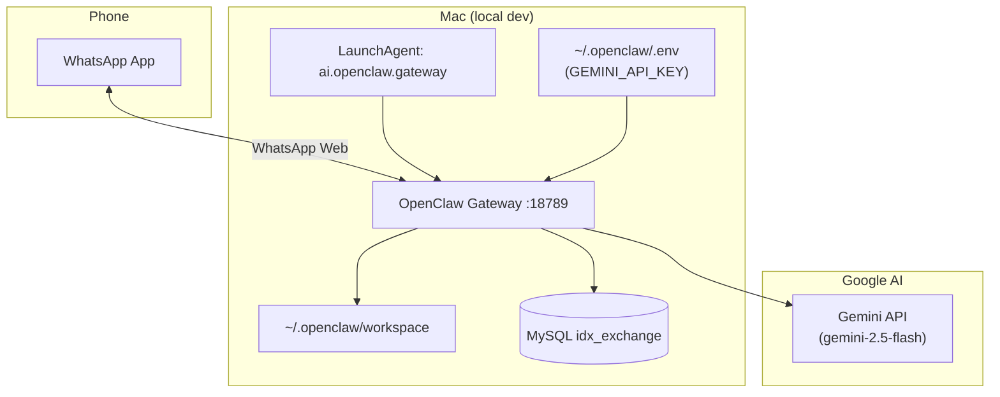

# IDX Exchange — OpenClaw Architecture

Week 1 deliverable: how user queries flow from WhatsApp through OpenClaw to the MLS databases and back.

## System overview

This internship builds a multi-agent real estate assistant on **OpenClaw**. Users interact via **WhatsApp**. OpenClaw receives messages, routes them to the right **skill**, executes **tools** (including MySQL queries), updates **session memory**, and returns formatted replies.

**Runtime stack (local dev)**

| Layer | Technology |
|-------|------------|
| Agent runtime | OpenClaw 2026.6.8 |
| LLM | Google Gemini (`gemini-2.5-flash`) |
| Channel | WhatsApp (linked device / self-chat) |
| Database | MySQL `idx_exchange` |
| Gateway | `ws://127.0.0.1:18789` (LaunchAgent service) |

**MLS data (intern subset)**

| Table | Rows | Purpose |
|-------|------|---------|
| `rets_property` | 53,122 | Active listings — search & discovery |
| `california_sold` | 87,157 | Sold comps — market analytics |
| `rets_openhouse` | 4,282 | Open house schedules (bonus) |

---

## End-to-end flow



**Request path (one sentence):** WhatsApp → OpenClaw Gateway → skill selection → tool calls against MySQL → memory update → reply to WhatsApp.

---

## OpenClaw components

### 1. Channels

Communication interfaces between users and the agent.

- **WhatsApp** is the primary channel for this project.
- Messages arrive at the gateway via a linked WhatsApp Web session.
- Config: `channels.whatsapp` in `~/.openclaw/openclaw.json` (allowlist + self-chat mode).

### 2. Skills

Modular capability units — each skill teaches the agent how to handle a class of tasks.

| Skill (planned) | Week | Role |
|-----------------|------|------|
| `property-search` | 2–3 | Parse NL queries → query `rets_property` |
| `market-stats` | 5 | Aggregations over `california_sold` |
| `semantic-search` | 6 | Embedding-based similarity search over `L_Remarks` |
| `recommendation` | 7 | Similar listings + comp validation |
| `rag-knowledge` | 8 | MLS field definitions & RE terminology |
| `orchestrator` | 9 | Route mixed-intent queries to agents |

Skills live as `SKILL.md` files (plus optional scripts) in the workspace or project repo.

### 3. Sessions

Per-user conversation state. OpenClaw tracks a session per WhatsApp peer (`session.dmScope: per-channel-peer`).

- Stores filters the user has mentioned (city, budget, beds).
- Enables multi-turn refinement (Week 4).
- Example session fields: `city`, `maxPrice`, `beds`, `lastResults`, `conversationStep`.

### 4. Tools

Typed async functions the agent can invoke — SQL queries, parsers, formatters, etc.

Examples in this project:

- `parsePropertyQuery(query)` — regex NLP → structured filters (Week 2)
- `searchActiveListings(filters)` — parameterized SQL on `rets_property` (Week 3)
- `getSoldComps(city, months)` — SQL on `california_sold` (Week 3)
- `semantic_search(query)` — embeds `query` and ranks listings by cosine
  similarity over a cached `L_Remarks` vector index (Week 6)

Tools must use **parameterized queries** (`?` placeholders) — never string-concatenate user input into SQL.

### 5. Memory

Two layers:

- **Short-term (session):** in-memory map keyed by user ID; holds active search filters and last result set.
- **Long-term:** a cached `numpy` vector index over listing remarks (Week 6, `semantic-search`), and later RAG document chunks.

Session memory is updated after each turn so follow-up messages like “make it under $1.2M” merge into the existing search.

### 6. Orchestrator

The routing layer (Week 9) that classifies intent and dispatches to specialized agents:

| Intent | Agent |
|--------|-------|
| `search` | propertySearchAgent |
| `market` | marketStatsAgent |
| `recommend` | recommendationAgent |
| `knowledge` | ragAgent |
| `mixed` | parallel agents → merged response |

Before Week 9, a single property-search skill handles search queries directly.

---

## Data layer

Both MLS tables live in schema **`idx_exchange`** (sourced from CRMLS via FTP SQL dumps).

**Key join:** active listings ↔ sold comps via `rets_property.L_ListingID` = `california_sold.ListingKey`, or city/ZIP for market-level analysis.

**Primary search table:** `rets_property`

| User intent | Column |
|-------------|--------|
| city | `L_City` |
| max price | `L_SystemPrice` |
| min beds | `L_Keyword2` |
| min baths | `LM_Dec_3` |
| min sq ft | `LM_Int2_3` |
| property type | `L_Type_` |
| pool | `PoolPrivateYN` |
| view | `ViewYN` |

**Comps / analytics table:** `california_sold` — `ClosePrice`, `CloseDate`, `DaysOnMarket`, `LivingArea`, etc.

---

## Example walkthrough

**User message (WhatsApp):**

> Show me 3-bedroom condos in Irvine under $1.5M with a pool.

| Step | Component | Action |
|------|-----------|--------|
| 1 | **Channel** | WhatsApp delivers message to gateway |
| 2 | **Gateway** | Authenticates sender (allowlist), opens session |
| 3 | **Orchestrator** | Detects property-search intent |
| 4 | **Skill** | Invokes `property-search` |
| 5 | **Tool** | `parsePropertyQuery()` returns structured filters |
| 6 | **Tool** | `searchActiveListings(filters)` runs parameterized SQL |
| 7 | **Memory** | Saves filters + result IDs to session |
| 8 | **Channel** | Formats top listings (address, price, beds/baths) → WhatsApp |

**Structured filter (Week 2 output):**

```json
{
  "city": "Irvine",
  "maxPrice": 1500000,
  "beds": 3,
  "baths": null,
  "sqft": null,
  "type": "Condominium",
  "pool": "True",
  "hasView": null
}
```

**SQL shape (Week 3):**

```sql
SELECT L_Address, L_City, L_SystemPrice, L_Keyword2, LM_Dec_3
FROM rets_property
WHERE L_Status = 'Active'
  AND L_City = ?
  AND L_SystemPrice <= ?
  AND L_Keyword2 >= ?
  AND L_Type_ = ?
  AND PoolPrivateYN = ?
ORDER BY L_SystemPrice ASC
LIMIT 10;
```

---

## Deployment diagram (local)



---

## Program roadmap (weeks 2–12)

| Week | Module | Adds to architecture |
|------|--------|----------------------|
| 2 | NL Property Search | `parsePropertyQuery` tool |
| 3 | Database Integration | MySQL connection pool + search tools — Done |
| 4 | Conversational Agent | Session memory + follow-ups — Done |
| 5 | Market Analytics | `california_sold` aggregation tools — Done |
| 6 | Embeddings | Vector search over `L_Remarks` — Done |
| 7 | Recommendations | Hybrid scoring + comp validation |
| 8 | RAG | Document retrieval for MLS terminology |
| 9 | Multi-Agent Orchestration | Intent router across all agents |
| 10 | WhatsApp Layer | Production message formatting |
| 11 | Email + Safety | Draft-then-approve email workflows |
| 12 | Capstone Demo | Full integrated assistant |

---

## Security notes

- API keys live in `.env` / `~/.openclaw/.env` — never committed to git.
- WhatsApp uses an allowlist (`allowFrom`) — only approved numbers can trigger the agent.
- SQL uses parameterized queries to prevent injection.
- Outbound email (Week 11) requires explicit human approval before send.
